# Authentication

bfloat's authentication system generates comprehensive, secure authentication solutions for React Native applications. The AI intelligently selects appropriate authentication patterns based on app requirements, security needs, and user experience goals.

## Authentication Strategy

### Intelligent Auth Pattern Selection

bfloat analyzes application requirements to choose optimal authentication approaches:

- **🔐 JWT Token-Based**: For stateless, scalable authentication
- **🌐 OAuth2/OIDC**: For third-party provider integration (Google, Apple, GitHub)
- **📱 Biometric Auth**: For enhanced mobile security (Face ID, Touch ID)
- **🔑 Multi-Factor Authentication**: For enterprise security requirements
- **🎫 Session-Based**: For traditional web-style authentication

### Authentication Architecture

```mermaid
graph TB
    User[👤 User] --> AuthFlow{Auth Method}
    
    AuthFlow -->|Credentials| EmailAuth[📧 Email/Password]
    AuthFlow -->|Social| OAuth[🌐 OAuth Providers]
    AuthFlow -->|Biometric| Biometric[👆 Face ID/Touch ID]
    
    EmailAuth --> JWT[🎫 JWT Token]
    OAuth --> JWT
    Biometric --> JWT
    
    JWT --> Storage[💾 Secure Storage]
    JWT --> API[🔗 API Requests]
    
    Storage --> Persistence[💿 Token Persistence]
    API --> Refresh[🔄 Token Refresh]
```



## Generated Authentication Components

### JWT Token Authentication

bfloat generates complete JWT-based authentication systems:

```typescript
// Generated authentication service
import AsyncStorage from '@react-native-async-storage/async-storage';
import { jwtDecode } from 'jwt-decode';

interface AuthTokens {
  accessToken: string;
  refreshToken: string;
  expiresAt: number;
}

interface User {
  id: string;
  email: string;
  name: string;
  avatar?: string;
  roles: string[];
}

interface LoginCredentials {
  email: string;
  password: string;
}

class AuthService {
  private baseURL = process.env.API_BASE_URL;

  async login(credentials: LoginCredentials): Promise<{ success: boolean; user?: User; error?: string }> {
    try {
      const response = await fetch(`${this.baseURL}/auth/login`, {
        method: 'POST',
        headers: {
          'Content-Type': 'application/json',
        },
        body: JSON.stringify(credentials),
      });

      if (!response.ok) {
        const errorData = await response.json();
        return { success: false, error: errorData.message || 'Login failed' };
      }

      const { user, tokens } = await response.json();
      
      await this.storeTokens(tokens);
      await this.storeUser(user);
      
      return { success: true, user };
    } catch (error) {
      return { 
        success: false, 
        error: error instanceof Error ? error.message : 'Network error' 
      };
    }
  }

  async getValidToken(): Promise<string | null> {
    const tokens = await this.getTokens();
    if (!tokens) return null;

    // Check if token is expired
    if (Date.now() >= tokens.expiresAt) {
      const refreshedTokens = await this.refreshToken();
      return refreshedTokens?.accessToken || null;
    }

    return tokens.accessToken;
  }

  private async refreshToken(): Promise<AuthTokens | null> {
    try {
      const currentTokens = await this.getTokens();
      if (!currentTokens) return null;

      const response = await fetch(`${this.baseURL}/auth/refresh`, {
        method: 'POST',
        headers: {
          'Content-Type': 'application/json',
        },
        body: JSON.stringify({ 
          refreshToken: currentTokens.refreshToken 
        }),
      });

      if (!response.ok) {
        await this.clearStorage();
        return null;
      }

      const tokens = await response.json();
      await this.storeTokens(tokens);
      
      return tokens;
    } catch (error) {
      await this.clearStorage();
      return null;
    }
  }
}

export const authService = new AuthService();
```

### Authentication Context

bfloat generates React context for authentication state management:

```typescript
// Generated authentication context
import React, { createContext, useContext, useEffect, useReducer, ReactNode } from 'react';
import { authService } from '../services/authService';

interface AuthState {
  user: User | null;
  isAuthenticated: boolean;
  isLoading: boolean;
  error: string | null;
}

type AuthAction =
  | { type: 'AUTH_START' }
  | { type: 'AUTH_SUCCESS'; payload: User }
  | { type: 'AUTH_FAILURE'; payload: string }
  | { type: 'AUTH_LOGOUT' }
  | { type: 'CLEAR_ERROR' };

interface AuthContextType extends AuthState {
  login: (credentials: LoginCredentials) => Promise<boolean>;
  register: (credentials: RegisterCredentials) => Promise<boolean>;
  logout: () => Promise<void>;
  clearError: () => void;
}

const AuthContext = createContext<AuthContextType | undefined>(undefined);

const authReducer = (state: AuthState, action: AuthAction): AuthState => {
  switch (action.type) {
    case 'AUTH_START':
      return { ...state, isLoading: true, error: null };
    
    case 'AUTH_SUCCESS':
      return {
        ...state,
        user: action.payload,
        isAuthenticated: true,
        isLoading: false,
        error: null,
      };
    
    case 'AUTH_FAILURE':
      return {
        ...state,
        user: null,
        isAuthenticated: false,
        isLoading: false,
        error: action.payload,
      };
    
    case 'AUTH_LOGOUT':
      return {
        ...state,
        user: null,
        isAuthenticated: false,
        isLoading: false,
        error: null,
      };
    
    case 'CLEAR_ERROR':
      return { ...state, error: null };
    
    default:
      return state;
  }
};

export const useAuth = (): AuthContextType => {
  const context = useContext(AuthContext);
  if (!context) {
    throw new Error('useAuth must be used within an AuthProvider');
  }
  return context;
};
```

### Login Screen

bfloat generates polished authentication screens:

```typescript
// Generated login screen
import React, { useState, useEffect } from 'react';
import {
  View,
  Text,
  TextInput,
  TouchableOpacity,
  StyleSheet,
  Alert,
  KeyboardAvoidingView,
  Platform,
} from 'react-native';
import { SafeAreaView } from 'react-native-safe-area-context';

import { useAuth } from '@/context/AuthContext';
import { Colors, Spacing, Typography } from '@/styles';
import { LoadingSpinner } from '@/components';

export const LoginScreen: React.FC = () => {
  const { login, isLoading, error, clearError } = useAuth();
  const [email, setEmail] = useState('');
  const [password, setPassword] = useState('');

  const handleLogin = async () => {
    if (!email || !password) {
      Alert.alert('Error', 'Please enter both email and password');
      return;
    }

    const success = await login({ email, password });
    if (success) {
      // Navigation handled by AuthNavigator
    }
  };

  return (
    <SafeAreaView style={styles.container}>
      <KeyboardAvoidingView
        style={styles.keyboardAvoidingView}
        behavior={Platform.OS === 'ios' ? 'padding' : 'height'}
      >
        <View style={styles.content}>
          <Text style={styles.title}>Welcome Back</Text>
          <Text style={styles.subtitle}>Sign in to your account</Text>

          <View style={styles.inputContainer}>
            <Text style={styles.label}>Email</Text>
            <TextInput
              style={styles.input}
              value={email}
              onChangeText={setEmail}
              placeholder="Enter your email"
              keyboardType="email-address"
              autoCapitalize="none"
              autoComplete="email"
            />
          </View>

          <View style={styles.inputContainer}>
            <Text style={styles.label}>Password</Text>
            <TextInput
              style={styles.input}
              value={password}
              onChangeText={setPassword}
              placeholder="Enter your password"
              secureTextEntry
              autoComplete="password"
            />
          </View>

          <TouchableOpacity
            style={[styles.loginButton, isLoading && styles.loginButtonDisabled]}
            onPress={handleLogin}
            disabled={isLoading}
          >
            {isLoading ? (
              <LoadingSpinner color={Colors.white} />
            ) : (
              <Text style={styles.loginButtonText}>Sign In</Text>
            )}
          </TouchableOpacity>
        </View>
      </KeyboardAvoidingView>
    </SafeAreaView>
  );
};
```

## OAuth2 Integration

### Social Authentication

bfloat generates OAuth2 integration for popular providers:

```typescript
// Generated OAuth service
import { GoogleSignin } from '@react-native-google-signin/google-signin';
import { appleAuth } from '@invertase/react-native-apple-authentication';

interface SocialAuthResult {
  success: boolean;
  user?: User;
  error?: string;
}

class SocialAuthService {
  private baseURL = process.env.API_BASE_URL;

  async signInWithGoogle(): Promise<SocialAuthResult> {
    try {
      await GoogleSignin.hasPlayServices();
      const userInfo = await GoogleSignin.signIn();
      
      // Send token to backend for verification
      const response = await fetch(`${this.baseURL}/auth/google`, {
        method: 'POST',
        headers: {
          'Content-Type': 'application/json',
        },
        body: JSON.stringify({
          idToken: userInfo.idToken,
          serverAuthCode: userInfo.serverAuthCode,
        }),
      });

      if (!response.ok) {
        throw new Error('Failed to authenticate with Google');
      }

      const { user, tokens } = await response.json();
      
      await authService.storeTokens(tokens);
      await authService.storeUser(user);
      
      return { success: true, user };
    } catch (error) {
      return {
        success: false,
        error: error instanceof Error ? error.message : 'Google sign in failed',
      };
    }
  }
}

export const socialAuthService = new SocialAuthService();
```

## Biometric Authentication

### Face ID / Touch ID Integration

bfloat generates biometric authentication for enhanced security:

```typescript
// Generated biometric authentication service
import ReactNativeBiometrics, { BiometryTypes } from 'react-native-biometrics';

interface BiometricAuthResult {
  success: boolean;
  error?: string;
  biometricType?: BiometryTypes;
}

class BiometricAuthService {
  private rnBiometrics = new ReactNativeBiometrics();

  async authenticateWithBiometrics(reason: string = 'Authenticate to access your account'): Promise<BiometricAuthResult> {
    try {
      const { available, biometryType } = await this.rnBiometrics.isSensorAvailable();
      
      if (!available) {
        return {
          success: false,
          error: 'Biometric authentication not available',
        };
      }

      const { success } = await this.rnBiometrics.simplePrompt({
        promptMessage: reason,
        cancelButtonText: 'Cancel',
      });

      return {
        success,
        biometricType,
        error: success ? undefined : 'Biometric authentication failed',
      };
    } catch (error) {
      return {
        success: false,
        error: error instanceof Error ? error.message : 'Biometric authentication error',
      };
    }
  }
}

export const biometricAuthService = new BiometricAuthService();
```

## Navigation Integration

### Authentication Navigator

bfloat generates navigation flows that handle authentication state:

```typescript
// Generated authentication navigator
import React from 'react';
import { createStackNavigator } from '@react-navigation/stack';

import { LoginScreen } from '@/screens/auth/LoginScreen';
import { RegisterScreen } from '@/screens/auth/RegisterScreen';

export type AuthStackParamList = {
  Login: undefined;
  Register: undefined;
};

const Stack = createStackNavigator<AuthStackParamList>();

export const AuthNavigator: React.FC = () => {
  return (
    <Stack.Navigator
      initialRouteName="Login"
      screenOptions={{
        headerShown: false,
      }}
    >
      <Stack.Screen name="Login" component={LoginScreen} />
      <Stack.Screen name="Register" component={RegisterScreen} />
    </Stack.Navigator>
  );
};
```

### App Navigator with Auth State

```typescript
// Generated main app navigator
import React from 'react';
import { NavigationContainer } from '@react-navigation/native';

import { useAuth } from '@/context/AuthContext';
import { AuthNavigator } from './AuthNavigator';
import { MainTabNavigator } from './MainTabNavigator';
import { LoadingSpinner } from '@/components';

export const AppNavigator: React.FC = () => {
  const { isAuthenticated, isLoading } = useAuth();

  if (isLoading) {
    return (
      <View style={{ flex: 1, justifyContent: 'center', alignItems: 'center' }}>
        <LoadingSpinner size="large" />
      </View>
    );
  }

  return (
    <NavigationContainer>
      {isAuthenticated ? <MainTabNavigator /> : <AuthNavigator />}
    </NavigationContainer>
  );
};
```

## Security Best Practices

### Generated Security Features

bfloat implements comprehensive security measures:

- **🔐 Token Encryption**: Sensitive data encrypted in storage
- **⏰ Token Expiration**: Automatic token refresh and cleanup
- **🚫 Jailbreak Detection**: Protection against compromised devices
- **📱 App State Security**: Hide sensitive content when backgrounded
- **🔄 Session Management**: Proper logout and cleanup procedures

### API Request Interceptor

```typescript
// Generated API client with auth interceptor
class ApiClient {
  private baseURL: string;
  
  constructor() {
    this.baseURL = process.env.API_BASE_URL || '';
  }

  async request<T>(
    endpoint: string,
    options: RequestInit = {}
  ): Promise<{ data?: T; error?: string }> {
    try {
      const token = await authService.getValidToken();
      
      const config: RequestInit = {
        ...options,
        headers: {
          'Content-Type': 'application/json',
          ...(token && { 'Authorization': `Bearer ${token}` }),
          ...options.headers,
        },
      };

      const response = await fetch(`${this.baseURL}${endpoint}`, config);

      if (response.status === 401) {
        // Token invalid, logout user
        await authService.logout();
        return { error: 'Authentication expired' };
      }

      if (!response.ok) {
        const errorData = await response.json();
        return { error: errorData.message || 'Request failed' };
      }

      const data = await response.json();
      return { data };
    } catch (error) {
      return {
        error: error instanceof Error ? error.message : 'Network error',
      };
    }
  }
}

export const apiClient = new ApiClient();
```

## Next Steps

- **[API Reference](/api/routes-overview/)** - Explore authentication API endpoints
- **[Components](/components/ui-components/)** - UI components for auth flows  
- **[Guides](/guides/adding-llm-providers/)** - Implementation guides and tutorials