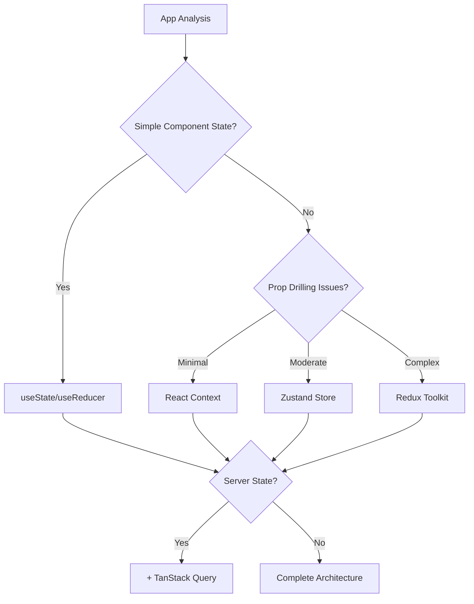

# State Management

bfloat's state management strategy focuses on generating maintainable, scalable React Native applications with appropriate state patterns based on app complexity and requirements. The AI system intelligently chooses between different state management approaches and generates the necessary boilerplate and patterns.

## State Management Strategy

### Intelligent Pattern Selection

The LLM analyzes the app requirements to choose the optimal state management approach:

- **🔄 Local State**: React's useState/useReducer for simple, component-scoped state
- **🌍 Global State**: Context API for moderate complexity with prop-drilling concerns
- **⚡ Zustand**: Lightweight global state for apps with moderate to high state complexity
- **🏪 Redux Toolkit**: Enterprise-grade state management for complex business logic
- **📡 TanStack Query**: Server state management with caching and synchronization

### Decision Matrix



## Generated State Patterns

### Local State Generation

For simple component state, bfloat generates clean useState and useReducer patterns:

```typescript
// Generated component with local state
import React, { useState, useReducer } from 'react';
import { View, Text, TouchableOpacity } from 'react-native';

interface CounterState {
  count: number;
  history: number[];
}

type CounterAction = 
  | { type: 'INCREMENT' }
  | { type: 'DECREMENT' }
  | { type: 'RESET' };

const counterReducer = (state: CounterState, action: CounterAction): CounterState => {
  switch (action.type) {
    case 'INCREMENT':
      return {
        count: state.count + 1,
        history: [...state.history, state.count + 1]
      };
    case 'DECREMENT':
      return {
        count: state.count - 1,
        history: [...state.history, state.count - 1]
      };
    case 'RESET':
      return { count: 0, history: [0] };
    default:
      return state;
  }
};

export const CounterScreen: React.FC = () => {
  const [state, dispatch] = useReducer(counterReducer, { count: 0, history: [0] });
  
  return (
    <View>
      <Text>Count: {state.count}</Text>
      <TouchableOpacity onPress={() => dispatch({ type: 'INCREMENT' })}>
        <Text>+</Text>
      </TouchableOpacity>
    </View>
  );
};
```

### Context API Generation

For moderate complexity apps, bfloat creates type-safe Context providers:

```typescript
// Generated theme context
import React, { createContext, useContext, useReducer, ReactNode } from 'react';

interface ThemeState {
  isDark: boolean;
  primaryColor: string;
  fontSize: 'small' | 'medium' | 'large';
}

interface ThemeContextType {
  theme: ThemeState;
  toggleTheme: () => void;
  updatePrimaryColor: (color: string) => void;
  setFontSize: (size: 'small' | 'medium' | 'large') => void;
}

const ThemeContext = createContext<ThemeContextType | undefined>(undefined);

type ThemeAction =
  | { type: 'TOGGLE_THEME' }
  | { type: 'SET_PRIMARY_COLOR'; payload: string }
  | { type: 'SET_FONT_SIZE'; payload: 'small' | 'medium' | 'large' };

const themeReducer = (state: ThemeState, action: ThemeAction): ThemeState => {
  switch (action.type) {
    case 'TOGGLE_THEME':
      return { ...state, isDark: !state.isDark };
    case 'SET_PRIMARY_COLOR':
      return { ...state, primaryColor: action.payload };
    case 'SET_FONT_SIZE':
      return { ...state, fontSize: action.payload };
    default:
      return state;
  }
};

export const ThemeProvider: React.FC<{ children: ReactNode }> = ({ children }) => {
  const [theme, dispatch] = useReducer(themeReducer, {
    isDark: false,
    primaryColor: '#007AFF',
    fontSize: 'medium'
  });

  const contextValue: ThemeContextType = {
    theme,
    toggleTheme: () => dispatch({ type: 'TOGGLE_THEME' }),
    updatePrimaryColor: (color: string) => dispatch({ type: 'SET_PRIMARY_COLOR', payload: color }),
    setFontSize: (size: 'small' | 'medium' | 'large') => dispatch({ type: 'SET_FONT_SIZE', payload: size })
  };

  return <ThemeContext.Provider value={contextValue}>{children}</ThemeContext.Provider>;
};

export const useTheme = (): ThemeContextType => {
  const context = useContext(ThemeContext);
  if (!context) {
    throw new Error('useTheme must be used within a ThemeProvider');
  }
  return context;
};
```

### Zustand Store Generation

For apps requiring lightweight global state, bfloat generates Zustand stores:

```typescript
// Generated user store with Zustand
import { create } from 'zustand';
import { persist, createJSONStorage } from 'zustand/middleware';
import AsyncStorage from '@react-native-async-storage/async-storage';

interface User {
  id: string;
  name: string;
  email: string;
  avatar?: string;
}

interface UserState {
  user: User | null;
  isAuthenticated: boolean;
  isLoading: boolean;
  
  // Actions
  setUser: (user: User) => void;
  logout: () => void;
  updateProfile: (updates: Partial<User>) => void;
  setLoading: (loading: boolean) => void;
}

export const useUserStore = create<UserState>()(
  persist(
    (set, get) => ({
      user: null,
      isAuthenticated: false,
      isLoading: false,

      setUser: (user: User) => set({ 
        user, 
        isAuthenticated: true,
        isLoading: false 
      }),

      logout: () => set({ 
        user: null, 
        isAuthenticated: false,
        isLoading: false 
      }),

      updateProfile: (updates: Partial<User>) => {
        const { user } = get();
        if (user) {
          set({ user: { ...user, ...updates } });
        }
      },

      setLoading: (isLoading: boolean) => set({ isLoading })
    }),
    {
      name: 'user-storage',
      storage: createJSONStorage(() => AsyncStorage),
      partialize: (state) => ({ 
        user: state.user, 
        isAuthenticated: state.isAuthenticated 
      })
    }
  )
);
```

### Redux Toolkit Generation

For complex enterprise applications, bfloat generates complete Redux Toolkit setups:

```typescript
// Generated Redux store configuration
import { configureStore } from '@reduxjs/toolkit';
import { persistStore, persistReducer } from 'redux-persist';
import AsyncStorage from '@react-native-async-storage/async-storage';
import { combineReducers } from 'redux';

import authSlice from './slices/authSlice';
import projectsSlice from './slices/projectsSlice';
import uiSlice from './slices/uiSlice';

const persistConfig = {
  key: 'root',
  storage: AsyncStorage,
  whitelist: ['auth', 'ui'] // Only persist specific slices
};

const rootReducer = combineReducers({
  auth: authSlice,
  projects: projectsSlice,
  ui: uiSlice
});

const persistedReducer = persistReducer(persistConfig, rootReducer);

export const store = configureStore({
  reducer: persistedReducer,
  middleware: (getDefaultMiddleware) =>
    getDefaultMiddleware({
      serializableCheck: {
        ignoredActions: ['persist/PERSIST', 'persist/REHYDRATE']
      }
    })
});

export const persistor = persistStore(store);

export type RootState = ReturnType<typeof store.getState>;
export type AppDispatch = typeof store.dispatch;
```

## Server State Management

### TanStack Query Integration

For apps with server state, bfloat generates TanStack Query configurations:

```typescript
// Generated API query hooks
import { useQuery, useMutation, useQueryClient } from '@tanstack/react-query';
import { api } from '../services/api';

interface Project {
  id: string;
  name: string;
  description: string;
  createdAt: string;
  updatedAt: string;
}

// Query hooks
export const useProjects = () => {
  return useQuery({
    queryKey: ['projects'],
    queryFn: () => api.getProjects(),
    staleTime: 5 * 60 * 1000, // 5 minutes
    cacheTime: 10 * 60 * 1000, // 10 minutes,
  });
};

export const useProject = (projectId: string) => {
  return useQuery({
    queryKey: ['projects', projectId],
    queryFn: () => api.getProject(projectId),
    enabled: !!projectId,
  });
};

// Mutation hooks
export const useCreateProject = () => {
  const queryClient = useQueryClient();
  
  return useMutation({
    mutationFn: (project: Omit<Project, 'id' | 'createdAt' | 'updatedAt'>) =>
      api.createProject(project),
    onSuccess: () => {
      queryClient.invalidateQueries({ queryKey: ['projects'] });
    },
  });
};

export const useUpdateProject = () => {
  const queryClient = useQueryClient();
  
  return useMutation({
    mutationFn: ({ id, updates }: { id: string; updates: Partial<Project> }) =>
      api.updateProject(id, updates),
    onSuccess: (updatedProject) => {
      queryClient.setQueryData(['projects', updatedProject.id], updatedProject);
      queryClient.invalidateQueries({ queryKey: ['projects'] });
    },
  });
};
```

## State Architecture Patterns

### Hybrid Approach

bfloat often generates hybrid state management approaches:

```typescript
// Component using multiple state management patterns
import React from 'react';
import { View, Text, FlatList } from 'react-native';
import { useUserStore } from '../store/userStore'; // Zustand for user state
import { useProjects } from '../hooks/useProjects'; // TanStack Query for server state
import { useTheme } from '../context/ThemeContext'; // Context for UI state

export const ProjectsScreen: React.FC = () => {
  const { user } = useUserStore();
  const { theme } = useTheme();
  const { data: projects, isLoading, error } = useProjects();

  return (
    <View style={{ backgroundColor: theme.isDark ? '#000' : '#fff' }}>
      <Text>Welcome, {user?.name}</Text>
      {isLoading ? (
        <Text>Loading projects...</Text>
      ) : (
        <FlatList
          data={projects}
          renderItem={({ item }) => <ProjectItem project={item} />}
          keyExtractor={(item) => item.id}
        />
      )}
    </View>
  );
};
```

## Best Practices Generated

### Type Safety

- **Strong typing** for all state interfaces and actions
- **Generic hooks** for reusable state patterns
- **Discriminated unions** for action types

### Performance Optimization

- **Selector patterns** to prevent unnecessary re-renders
- **Memoization** of expensive computations
- **Lazy loading** of state modules

### Error Handling

- **Error boundaries** for state-related crashes
- **Fallback states** for failed operations
- **Loading states** for better UX

### Testing Support

- **Mock stores** for testing components
- **State factories** for test data generation
- **Integration test helpers** for state flows

## State Management Evolution

### Scalability Patterns

bfloat generates state architectures that can evolve:

1. **Start Simple**: Begin with local state and Context
2. **Add Complexity**: Introduce Zustand for global state
3. **Scale Up**: Migrate to Redux Toolkit for enterprise needs
4. **Optimize**: Add server state management with TanStack Query

### Migration Strategies

The generated code includes migration paths between state management approaches, allowing apps to evolve their state architecture as requirements change.

## Next Steps

- **[File System](/core-concepts/file-system/)** - Understanding file structure and organization
- **[Authentication](/core-concepts/authentication/)** - User authentication and authorization patterns
- **[API Reference](/api/routes-overview/)** - Explore the complete API documentation