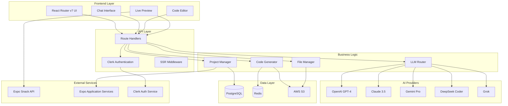
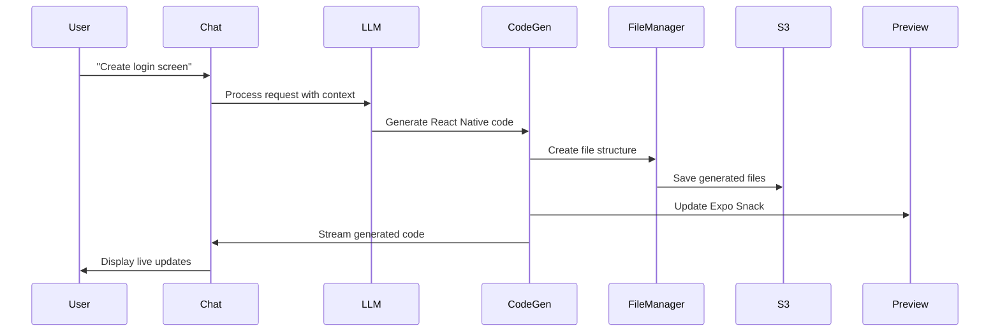

# Architecture Deep Dive

Understanding bfloat's architecture is crucial for developers who want to contribute, extend features, or optimize performance. This guide breaks down every layer of the system from user interaction to AI-generated code deployment.

## System Overview

bfloat follows a modern full-stack architecture optimized for AI-powered code generation at scale. The platform handles complex workflows from conversational prompts to production-ready React Native applications.



## Frontend Architecture

### React Router v7 Implementation

bfloat uses React Router v7's file-based routing with server-side rendering for optimal performance and SEO.

```typescript
// app/routes/_index.tsx - Homepage
export default function Index() {
  return <HomePage />;
}

// app/routes/projects.$id.tsx - Dynamic project routes
export async function loader({ params }: LoaderFunctionArgs) {
  const project = await getProject(params.id);
  return json({ project });
}

// app/routes/api.chat.ts - API route for chat
export async function action({ request }: ActionFunctionArgs) {
  const formData = await request.formData();
  return streamLLMResponse(formData);
}
```

### State Management Strategy

**Zustand Stores** for client-side state:

```typescript
// app/stores/editor.ts
interface EditorState {
  files: FileMap;
  activeFile: string | null;
  isGenerating: boolean;
  setFiles: (files: FileMap) => void;
  setActiveFile: (path: string) => void;
}

// app/stores/workbench.ts
interface WorkbenchState {
  project: Project | null;
  messages: Message[];
  isStreaming: boolean;
  addMessage: (message: Message) => void;
}
```

**TanStack Query** for server state:

```typescript
// app/hooks/use-projects.ts
export function useProjects() {
  return useQuery({
    queryKey: ['projects'],
    queryFn: () => fetch('/api/projects').then(r => r.json()),
    staleTime: 5 * 60 * 1000, // 5 minutes
  });
}
```

### Component Architecture

**Atomic Design Pattern** with Radix UI primitives:

```
app/components/
├── ui/                 # Atomic components (Button, Input, etc.)
├── chat/              # Chat-specific molecules
├── editor/            # Code editor organisms  
├── project/           # Project management templates
└── layout/            # Layout templates
```

## Backend Architecture

### Route Handler Pattern

React Router v7 uses a unified approach for both page and API routes:

```typescript
// app/routes/api.chat.ts
export async function action({ request }: ActionFunctionArgs) {
  const { message, projectId } = await request.json();
  
  // Authenticate user
  const userId = await requireAuth(request);
  
  // Stream LLM response
  return streamResponse(async function* () {
    const stream = await generateCode(message, projectId);
    for await (const chunk of stream) {
      yield `data: ${JSON.stringify(chunk)}\n\n`;
    }
  });
}
```

### Database Layer with Prisma

**Schema Design** optimized for AI workflows:

```prisma
model Project {
  id          String   @id @default(cuid())
  name        String
  userId      String
  s3Key       String?  // S3 bucket key for file storage
  template    String   @default("expo-router")
  isPublic    Boolean  @default(false)
  
  messages    Message[]
  deployments Deployment[]
  
  createdAt   DateTime @default(now())
  updatedAt   DateTime @updatedAt
}

model Message {
  id        String      @id @default(cuid())
  content   String
  role      MessageRole // USER, ASSISTANT, SYSTEM
  projectId String
  
  project   Project     @relation(fields: [projectId], references: [id])
  artifacts Artifact[]  // Generated files/components
  
  createdAt DateTime    @default(now())
}

model Artifact {
  id        String       @id @default(cuid())
  type      ArtifactType // FILE, COMPONENT, SCREEN
  path      String       // File path in project
  content   String       // Generated code
  messageId String
  
  message   Message      @relation(fields: [messageId], references: [id])
  
  createdAt DateTime     @default(now())
}
```

### File Storage Strategy

**AWS S3** for generated React Native projects:

```typescript
// app/lib/storage.ts
export class ProjectStorage {
  async saveProject(projectId: string, files: FileMap) {
    const s3Key = `projects/${projectId}/files.json`;
    
    await this.s3Client.putObject({
      Bucket: 'bfloat-projects',
      Key: s3Key,
      Body: JSON.stringify(files),
      ContentType: 'application/json',
    });
    
    return s3Key;
  }
  
  async loadProject(s3Key: string): Promise<FileMap> {
    const object = await this.s3Client.getObject({
      Bucket: 'bfloat-projects',
      Key: s3Key,
    });
    
    return JSON.parse(await object.Body.transformToString());
  }
}
```

## AI Integration Architecture

### Multi-Provider Strategy

**Model Router** intelligently selects the best AI provider for each task:

```typescript
// app/lib/llm/model-router.ts
export class ModelRouter {
  async routeRequest(request: LLMRequest): Promise<LLMProvider> {
    const { type, complexity, context } = request;
    
    switch (type) {
      case 'code_generation':
        return complexity > 0.7 ? 'deepseek-coder' : 'claude-3.5-sonnet';
      case 'ui_design':
        return 'claude-3.5-sonnet';
      case 'architecture':
        return 'gpt-4-turbo';
      case 'debugging':
        return 'gemini-pro';
      default:
        return this.selectByAvailability();
    }
  }
}
```

### Context Management

**Sliding Context Window** for long conversations:

```typescript
// app/lib/llm/extract-context.ts
export function extractRelevantContext(
  messages: Message[],
  maxTokens: number
): Message[] {
  const context: Message[] = [];
  let tokenCount = 0;
  
  // Always include system message
  const systemMessage = messages.find(m => m.role === 'SYSTEM');
  if (systemMessage) {
    context.push(systemMessage);
    tokenCount += countTokens(systemMessage.content);
  }
  
  // Include most recent messages within token limit
  for (let i = messages.length - 1; i >= 0; i--) {
    const message = messages[i];
    const messageTokens = countTokens(message.content);
    
    if (tokenCount + messageTokens > maxTokens) break;
    
    context.unshift(message);
    tokenCount += messageTokens;
  }
  
  return context;
}
```

## Real-time Communication

### Server-Sent Events Implementation

**Streaming Code Generation** with SSE:

```typescript
// app/lib/llm/stream-text.server.ts
export async function streamLLMResponse(
  messages: Message[],
  projectId: string
) {
  const stream = new ReadableStream({
    async start(controller) {
      try {
        const llmStream = await openai.chat.completions.create({
          model: 'gpt-4-turbo',
          messages: formatMessages(messages),
          stream: true,
        });
        
        for await (const chunk of llmStream) {
          const delta = chunk.choices[0]?.delta?.content;
          if (delta) {
            controller.enqueue(`data: ${JSON.stringify({ 
              type: 'content',
              content: delta 
            })}\n\n`);
          }
        }
        
        controller.close();
      } catch (error) {
        controller.error(error);
      }
    }
  });
  
  return new Response(stream, {
    headers: {
      'Content-Type': 'text/event-stream',
      'Cache-Control': 'no-cache',
      'Connection': 'keep-alive',
    },
  });
}
```

### Background Job Processing

**BullMQ + Redis** for intensive operations:

```typescript
// app/lib/queue.server.ts
export const codeGenerationQueue = new Queue('code-generation', {
  connection: redis,
});

export const codeGenerationWorker = new Worker(
  'code-generation',
  async (job) => {
    const { projectId, prompt, userId } = job.data;
    
    // Generate code with full context
    const result = await generateCompleteApp({
      projectId,
      prompt,
      userId,
    });
    
    // Update project in database
    await updateProject(projectId, result);
    
    // Notify user via WebSocket
    await notifyUser(userId, {
      type: 'generation_complete',
      projectId,
    });
    
    return result;
  },
  { connection: redis }
);
```

## Code Generation Pipeline

### File Generation Workflow



### Code Quality Pipeline

**Multi-stage validation** ensures production-ready output:

```typescript
// app/lib/code-validation.ts
export class CodeValidator {
  async validateGeneration(code: string, type: 'component' | 'screen'): Promise<ValidationResult> {
    const results = await Promise.all([
      this.syntaxValidation(code),
      this.typeScriptValidation(code),
      this.reactNativeValidation(code),
      this.accessibilityValidation(code),
    ]);
    
    return this.aggregateResults(results);
  }
  
  private async reactNativeValidation(code: string) {
    // Check for React Native best practices
    const issues = [];
    
    if (!code.includes('StyleSheet.create')) {
      issues.push('Should use StyleSheet.create for styling');
    }
    
    if (code.includes('TouchableOpacity') && !code.includes('accessibilityRole')) {
      issues.push('TouchableOpacity should have accessibilityRole');
    }
    
    return { issues, severity: 'warning' };
  }
}
```

## Performance Optimizations

### Client-Side Optimizations

**Code Splitting** for large React Native projects:

```typescript
// app/components/editor/EditorPanel.tsx
const CodeMirrorEditor = lazy(() => import('./CodeMirrorEditor'));

export function EditorPanel({ files }: { files: FileMap }) {
  return (
    <Suspense fallback={<EditorSkeleton />}>
      <CodeMirrorEditor files={files} />
    </Suspense>
  );
}
```

**Virtual Scrolling** for large file trees:

```typescript
// app/components/editor/FileTree.tsx
export function FileTree({ files }: { files: FileNode[] }) {
  const virtualizer = useVirtualizer({
    count: files.length,
    getScrollElement: () => parentRef.current,
    estimateSize: () => 24,
  });
  
  return (
    <div ref={parentRef} className="h-96 overflow-auto">
      <div style={{ height: virtualizer.getTotalSize() }}>
        {virtualizer.getVirtualItems().map((virtualRow) => (
          <FileTreeItem
            key={virtualRow.key}
            file={files[virtualRow.index]}
            style={{
              position: 'absolute',
              top: virtualRow.start,
              height: virtualRow.size,
            }}
          />
        ))}
      </div>
    </div>
  );
}
```

### Server-Side Optimizations

**Database Query Optimization**:

```typescript
// app/dao/projects.server.ts
export async function getProjectWithMessages(projectId: string) {
  return prisma.project.findUnique({
    where: { id: projectId },
    include: {
      messages: {
        orderBy: { createdAt: 'asc' },
        include: {
          artifacts: true,
        },
      },
    },
  });
}

// Use database indexing
// prisma/schema.prisma
model Message {
  // ... other fields
  @@index([projectId, createdAt])
}
```

**Redis Caching Strategy**:

```typescript
// app/lib/redis-cache.ts
export class ProjectCache {
  async getProject(projectId: string): Promise<Project | null> {
    const cached = await redis.get(`project:${projectId}`);
    if (cached) {
      return JSON.parse(cached);
    }
    
    const project = await db.project.findUnique({ where: { id: projectId } });
    if (project) {
      await redis.setex(`project:${projectId}`, 300, JSON.stringify(project));
    }
    
    return project;
  }
}
```

## Security Architecture

### Authentication & Authorization

**Clerk Integration** with custom session management:

```typescript
// app/lib/auth.server.ts
export async function requireAuth(request: Request): Promise<string> {
  const { userId } = await getAuth(request);
  
  if (!userId) {
    throw redirect('/sign-in');
  }
  
  return userId;
}

export async function requireProjectAccess(
  request: Request,
  projectId: string
): Promise<Project> {
  const userId = await requireAuth(request);
  
  const project = await prisma.project.findFirst({
    where: {
      id: projectId,
      OR: [
        { userId },
        { isPublic: true },
      ],
    },
  });
  
  if (!project) {
    throw new Response('Project not found', { status: 404 });
  }
  
  return project;
}
```

### Data Protection

**Sensitive Data Handling**:

```typescript
// app/lib/encryption.ts
export class DataProtection {
  async encryptAPIKey(apiKey: string): Promise<string> {
    const cipher = crypto.createCipher('aes-256-gcm', process.env.ENCRYPTION_KEY);
    let encrypted = cipher.update(apiKey, 'utf8', 'hex');
    encrypted += cipher.final('hex');
    return encrypted;
  }
  
  async sanitizeUserInput(input: string): Promise<string> {
    // Remove potentially malicious content
    return DOMPurify.sanitize(input, {
      ALLOWED_TAGS: ['code', 'pre', 'b', 'i', 'em', 'strong'],
      ALLOWED_ATTR: [],
    });
  }
}
```

## Deployment Architecture

### Docker Configuration

```dockerfile
# Dockerfile
FROM node:20-alpine AS builder

WORKDIR /app
COPY package*.json ./
RUN npm ci --only=production

COPY . .
RUN npm run build

FROM node:20-alpine AS runner
WORKDIR /app

COPY --from=builder /app/build ./build
COPY --from=builder /app/node_modules ./node_modules
COPY --from=builder /app/package.json ./package.json

EXPOSE 3000
CMD ["npm", "start"]
```

### Fly.io Configuration

```toml
# fly.toml
app = "bfloat-app"
primary_region = "sea"

[build]
  dockerfile = "Dockerfile"

[env]
  PORT = "3000"
  NODE_ENV = "production"

[[services]]
  http_checks = []
  internal_port = 3000
  processes = ["app"]
  protocol = "tcp"

  [[services.ports]]
    force_https = true
    handlers = ["http"]
    port = 80

  [[services.ports]]
    handlers = ["tls", "http"]
    port = 443
```

## Monitoring & Observability

### Performance Monitoring

```typescript
// app/lib/monitoring.ts
export class PerformanceMonitor {
  static trackLLMRequest(provider: string, tokens: number, duration: number) {
    // Track metrics for AI provider performance
    metrics.histogram('llm_request_duration', duration, {
      provider,
      token_count: tokens.toString(),
    });
  }
  
  static trackCodeGeneration(linesOfCode: number, complexity: string) {
    metrics.histogram('code_generation_size', linesOfCode, {
      complexity,
    });
  }
}
```

This architecture supports bfloat's mission to generate production-quality React Native applications through AI while maintaining high performance, security, and reliability standards. The next section will dive deep into how the LLM integration layer orchestrates multiple AI providers for optimal code generation.

## Next: Core Concepts - LLM Integration

Ready to understand how bfloat orchestrates multiple AI providers? Continue to **[LLM Integration](/core-concepts/llm-integration/)** to learn about the intelligent model routing, context management, and code generation pipeline that powers the platform.