# Project Overview

bfloat is an AI-powered platform that transforms natural language descriptions into complete, production-ready React Native mobile applications. Think "Vercel v0 for React Native" - but with the full power of modern LLM reasoning and comprehensive mobile development workflows.

## What bfloat Does

### 🎯 Core Mission
**Generate entire React Native apps from conversational prompts**, handling everything from UI components to navigation, state management, API integrations, and deployment pipelines.

### 💫 Key Capabilities
- **Multi-turn Conversations**: Iterative app development through chat interface
- **Complete App Generation**: Not just components - full app structures with navigation
- **Real-time Preview**: Live Expo-powered preview as the AI builds your app
- **Multi-Provider AI**: Leverages OpenAI, Anthropic, Google, DeepSeek, and xAI models
- **Production Ready**: Generates optimized, well-structured React Native code
- **Deployment Pipeline**: Direct integration with Expo Application Services (EAS)

## Platform Architecture

```mermaid
graph TB
    User[👤 User] --> Chat[💬 Chat Interface]
    Chat --> Router[🚦 React Router v7]
    Router --> LLM[🧠 LLM Orchestrator]
    
    LLM --> OpenAI[OpenAI GPT-4]
    LLM --> Anthropic[Claude 3.5 Sonnet]
    LLM --> Google[Gemini Pro]
    LLM --> DeepSeek[DeepSeek Coder]
    
    LLM --> FileGen[📁 File Generator]
    FileGen --> S3[☁️ AWS S3 Storage]
    FileGen --> Preview[📱 Expo Snack Preview]
    
    Router --> DB[(🗄️ PostgreSQL)]
    DB --> Projects[Projects & Metadata]
    DB --> Messages[Chat History]
    DB --> Users[User Management]
```

### Frontend Stack
- **React Router v7**: File-based routing with SSR capabilities
- **TypeScript**: End-to-end type safety
- **TailwindCSS + Radix UI**: Modern component system
- **Zustand**: Lightweight state management
- **TanStack Query**: Server state synchronization
- **CodeMirror**: Advanced code editor with React Native syntax

### Backend Architecture
- **Node.js + Prisma**: Database ORM with type generation
- **PostgreSQL**: Primary data store for projects and user data
- **AWS S3**: File storage for generated React Native projects
- **BullMQ + Redis**: Background job processing for AI generation
- **Server-Sent Events**: Real-time streaming for live code generation

### AI Integration Layer
- **Model Router**: Intelligent routing between different AI providers
- **Context Management**: Efficient prompt engineering with sliding context windows  
- **Code Generation Pipeline**: Structured approach to generating React Native code
- **Quality Assurance**: Built-in validation and error recovery mechanisms

## User Journey

### 1. **Project Creation**
User starts a conversation describing their app idea:
> "Create a fitness tracking app with workout logging and progress charts"

### 2. **AI Planning** 
The LLM analyzes the request and creates a structured plan:
- App architecture decisions
- Component breakdown
- Navigation structure
- State management approach

### 3. **Code Generation**
AI generates React Native code in real-time:
- **Components**: Custom UI components with proper styling
- **Screens**: Complete screen implementations with navigation
- **State**: Redux/Context/Zustand setup based on complexity
- **Assets**: Icon generation and image optimization

### 4. **Live Preview**
As code is generated, users see:
- **Real-time Expo preview** in web and mobile
- **File tree** showing project structure
- **Code editor** with syntax highlighting and IntelliSense

### 5. **Iteration & Refinement**
Users can request changes conversationally:
> "Make the buttons larger and change the theme to dark mode"

### 6. **Deployment**
One-click deployment through:
- **Expo Application Services (EAS)**
- **App Store Connect** integration
- **Google Play Console** automation

## Technical Differentiators

### 🚀 **Multi-Model AI Strategy**
Unlike single-provider solutions, bfloat intelligently routes requests based on:
- **Code generation**: DeepSeek Coder for complex logic
- **UI/UX decisions**: Claude 3.5 for design reasoning
- **Architecture**: GPT-4 for high-level planning
- **Error fixing**: Gemini Pro for debugging assistance

### 🏗️ **React Native Focus**
Purpose-built for mobile development:
- **Platform-specific optimizations** (iOS/Android)
- **Navigation patterns** (Stack, Tab, Drawer)
- **Mobile UI patterns** (Pull-to-refresh, infinite scroll)
- **Device APIs** (Camera, location, sensors)

### ⚡ **Real-time Development**
- **Streaming code generation** with Server-Sent Events
- **Live preview** updates as AI writes code
- **Instant feedback loop** for rapid iteration

### 🔧 **Production Quality**
- **TypeScript-first** code generation
- **Best practices** enforcement (accessibility, performance)
- **Testing setup** with Jest and React Native Testing Library
- **CI/CD pipeline** integration with EAS Build

## Target Developers

### Primary Users
- **Mobile app entrepreneurs** who need MVP development speed
- **Frontend developers** extending into React Native
- **Full-stack developers** building mobile backends
- **Design-to-code workflows** for agencies and teams

### Use Cases
- **Rapid prototyping** for user testing and investor demos
- **MVP development** for startups and side projects
- **Learning React Native** through AI-generated examples
- **Code generation acceleration** for experienced developers

## Next Steps

Ready to dive deeper? Here's your learning path:

1. **[Quick Start](/getting-started/quick-start/)** - Get the development environment running
2. **[Architecture Deep Dive](/getting-started/architecture/)** - Understand the technical implementation
3. **[LLM Integration](/core-concepts/llm-integration/)** - Learn how AI providers work together
4. **[Development Setup](/getting-started/development-setup/)** - Complete developer workflow setup